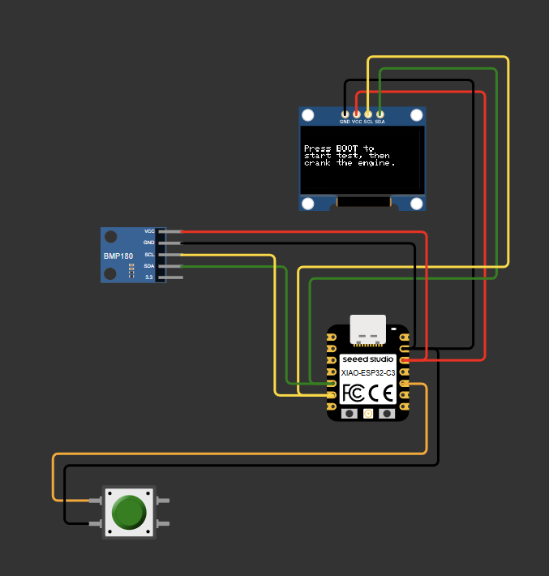
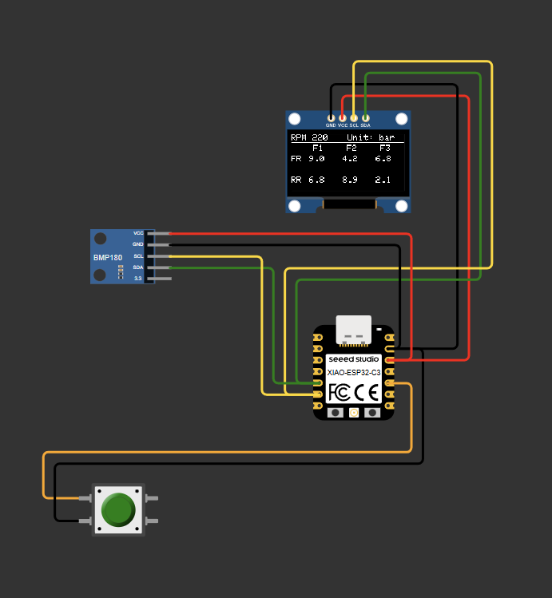

# Rotary engine compression tester IOT project

Idea is to create engine compression tester device for wankel rotary engine. This is different than the one for normal piston engine, instead of up and down moving pistons there are two spinning Reuleaux triangles. Each triangle have three faces and each face have it's own compression stage. Tester measures pressure via pressure sensor and then compensates measured values with barometric pressure and RPM correction coeff to give most accurate reading regarding how good/bad starter motor or battery is and in what altitude engine is tested.

